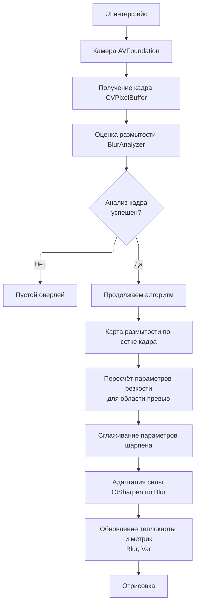
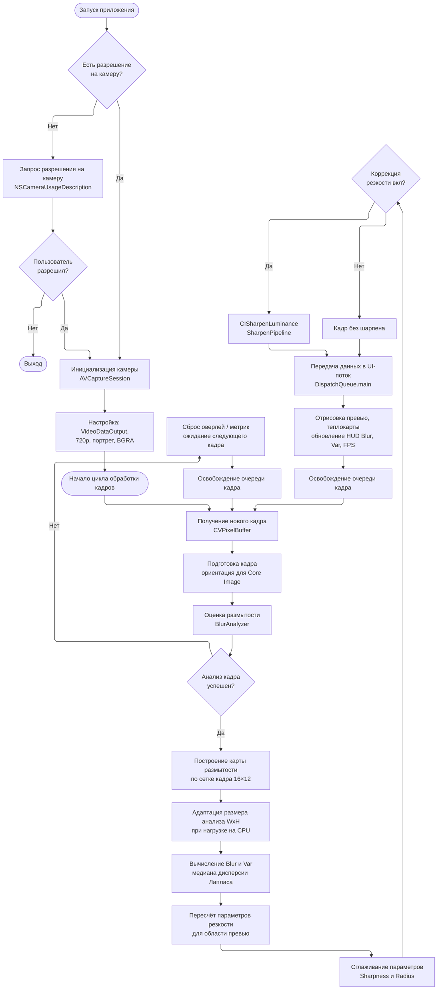
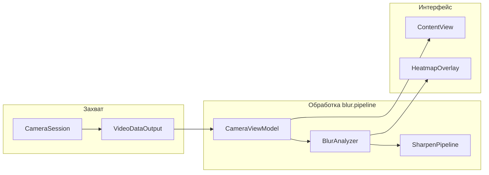

# Схема общего алгоритма — BlurAdaptiveCamera (вариант 14)

Блок-схема конвейера: оценка **размытости** кадра и **адаптивная резкость** в реальном времени (iOS, SwiftUI).

---

## Рисунок 1 — Функциональная схема (как на референсе)

Та же **форма**, что в методичке: 4 блока сверху → **ромб** → слева **пустой оверлей**, справа **продолжаем алгоритм** → **6 блоков** подряд → **отрисовка**.  
Тема — **размытость и адаптивная резкость** (вариант 14), без лиц.

| Блок на референсе | Ваш проект BlurAdaptiveCamera |
|-------------------|-------------------------------|
| Камера CameraX | Камера AVFoundation |
| Получение кадра ImageProxy | Получение кадра CVPixelBuffer |
| Обнаружение лица ML Kit | Оценка размытости BlurAnalyzer |
| Есть лицо? | Анализ кадра успешен? |
| Оценка точки взгляда в координатах кадра | Карта размытости по сетке кадра |
| Пересчёт в координаты области экрана | Пересчёт параметров резкости для превью |
| Сглаживание траектории точки взгляда | Сглаживание параметров шарпена |
| Детектор фиксации | Адаптация силы CISharpen по Blur |
| Обновление списка координат фиксаций | Обновление теплокарты и метрик Blur, Var |
| Отрисовка | Отрисовка |

**Подпись для отчёта:** *Рисунок 1 – Функциональная модульная схема*

*Как читать схему:* при неудачном анализе кадра оверлей и метрики не обновляются (**пустой оверлей**). При успехе выполняется цепочка от карты размытости до **отрисовки** превью с теплокартой и HUD.

---

## Рисунок 2 — Схема общего алгоритма (как на референсе)

Полная блок-схема: **запуск → разрешение → камера → цикл кадров → анализ размытости → ветка «нет/да»** → цепочка обработки → UI → снова кадр.

| Блок на референсе | BlurAdaptiveCamera |
|-------------------|-------------------|
| Preview и ImageAnalysis | VideoDataOutput, BGRA |
| InputImage + ML Kit | Подготовка кадра + BlurAnalyzer |
| Лицо обнаружено? | Анализ кадра успешен? |
| Выбор лица, контуры глаз | Сетка 16×12, адаптация WxH |
| Оценка взгляда, пересчёт, сглаживание | Blur/Var, параметры шарпена, сглаживание |
| Фиксации | CISharpen (если коррекция вкл.) |
| Закрытие ImageProxy | Освобождение очереди кадра (семафор) |

**Файлы для скачивания:** `Рисунок2_схема.png`, исходник `Рисунок2_схема.mmd`

**Подпись для отчёта:** *Рисунок 2 – Схема общего алгоритма приложения BlurAdaptiveCamera*

---

## Функциональная модульная схема (блоки кода)

## Пояснение блоков

| Блок | Модуль | Назначение |
|------|--------|------------|
| UI | `ContentView` | Превью, теплокарта, HUD, переключатели |
| Камера | `CameraSession` | 720p, портрет, BGRA |
| Кадр | делегат `cameraSession` | `CVPixelBuffer` + ориентация |
| Анализ | `BlurAnalyzer` | Даунскейл, Лаплас, Var, Blur, heatmap |
| Адаптация | `CameraViewModel` | Размер анализа, Sharpness, Radius |
| Резкость | `SharpenPipeline` | `CISharpenLuminance` на весь кадр |
| Отрисовка | main queue | `previewImage`, метрики, оверлей сетки |
